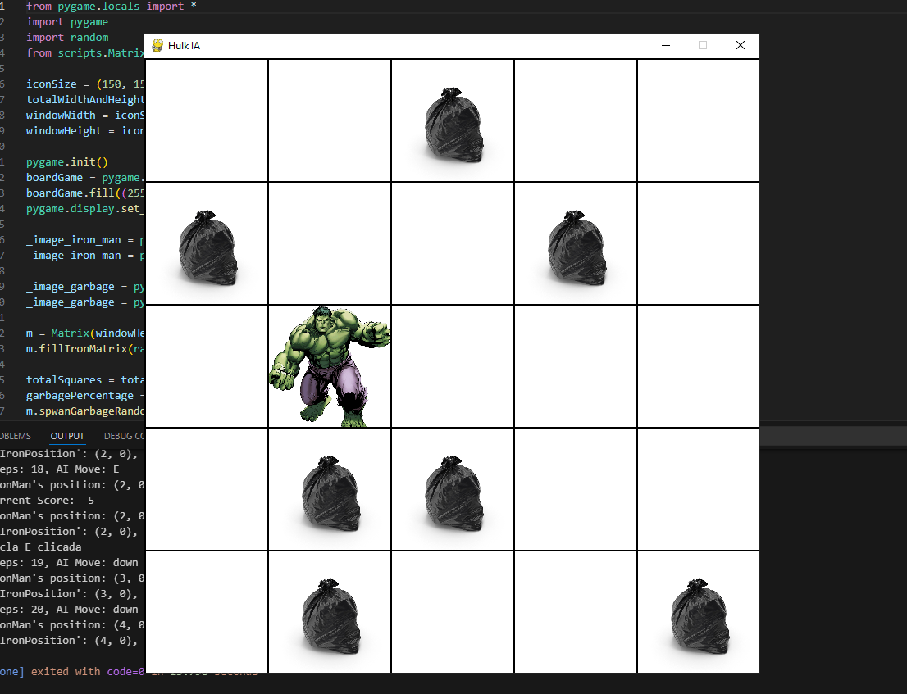

# Hulk IA - Reinforcement Learning Game with Pygame

This project implements a **reinforcement learning** game using **Pygame** where an agent (Hulk) navigates a grid-like environment filled with garbage. The objective is to collect garbage while avoiding penalties.

The game simulates a learning environment where the agent interacts with the environment, moves around, and learns from the consequences of its actions (rewards and penalties). The state of the game and the agent's movement are represented in a matrix, and the game allows for real-time interaction with the agent's actions.

## Features

- **Grid-Based Game**: The environment is a grid where Hulk (the agent) moves around to collect garbage.
- **Movement & Interaction**: The agent can move left, right, up, down, or interact by pressing the 'E' key to collect garbage.
- **Penalties & Rewards**: The agent receives a penalty for invalid moves and a reward for collecting garbage.
- **Graphical Interface**: The game uses **Pygame** to provide a graphical interface with Iron Man and garbage icons.




## Technologies Used

- **Python**: The main programming language used for implementing the game and reinforcement learning logic.
- **Pygame**: A Python library used for game development and rendering the graphical interface.
- **Reinforcement Learning**: Basic reinforcement learning concepts such as penalties and rewards are applied to the agent's movement.
- **Matrix Class**: A custom `Matrix` class manages the game grid and logic for the agent's actions.

## Installation & Running the Game

1. **Clone the repository**:

   ```bash
   git clone https://github.com/DamienNaz/IA---reinforcement-learning-game-with-pygame.git
